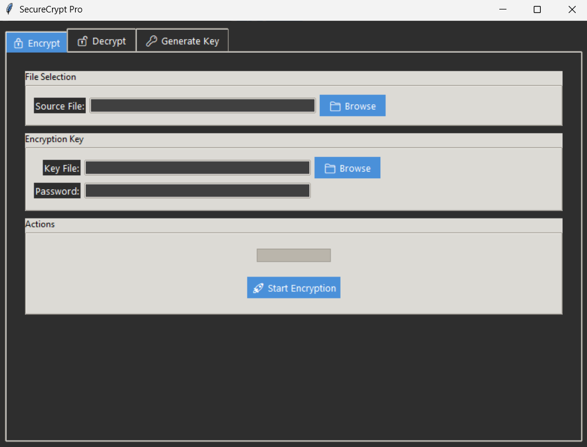

#  SecureCrypt Pro - File Encryption Tool 🔒

A secure desktop application for file encryption/decryption implementing modern cryptographic standards with audit capabilities. Developed to demonstrate core security principles for cybersecurity applications.

## Key Features

### Cryptographic Implementation
- **Algorithms**: AES-256-CBC (with PKCS#7 padding) & ChaCha20
- **Key Derivation**: PBKDF2-HMAC-SHA256 (480,000 iterations - NIST compliant)
- **Security Protections**:
  - Constant-time comparison (timing attack mitigation)
  - Tamper detection via authentication tags
  - Secure salt generation (os.urandom)

### Application Architecture
- **Audit Trail**: Comprehensive logging of all cryptographic operations
- **Key Management**: Secure generation and password-based derivation
- **Defensive Programming**: Exception handling for all crypto operations

### User Experience
- Password strength visualization
- Operation progress tracking
- Cross-platform compatibility 

## Technical Highlights

# Security-focused key derivation (PBKDF2)
kdf = PBKDF2HMAC(

    algorithm=hashes.SHA256(),
    
    length=32,  # 256-bit key
    
    salt=salt,  # 16-byte cryptographically random
    
    iterations=PBKDF2_ITERATIONS,  # 480,000 - OWASP recommended
    
    backend=default_backend()
)

## Installation

 **Requirements**:
   -Python 3.8+ (verified on 3.10.6)
   
   -Libraries: cryptography, tkinter

